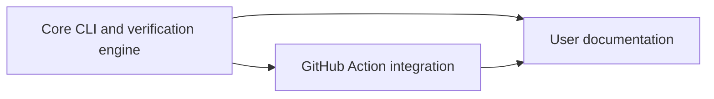

# ReleaseCheck Documentation

  

Guides for using [ReleaseCheck](https://github.com/ReleaseCheck/releasecheck), a tool that compares published npm and PyPI packages with their claimed source releases.

[Core and implementation](https://github.com/ReleaseCheck/releasecheck) · [GitHub Action](https://github.com/ReleaseCheck/releasecheck-action) · [Documentation issues](https://github.com/ReleaseCheck/releasecheck-docs/issues)

## Choose a path

| If you want to... | Start here |
| --- | --- |
| Understand the evidence ReleaseCheck collects | [What is ReleaseCheck?](docs/what-is-releasecheck.md) |
| Build it and verify a package | [Quickstart](docs/quickstart.md) |
| Select commands and output formats | [CLI usage](docs/cli-usage.md) |
| Interpret a verdict or file difference | [Understanding results](docs/results.md) |
| Add checks to continuous integration | [CI usage](docs/ci.md) |
| Use the official GitHub Action | [GitHub Action](docs/github-action.md) |
| Understand what the tool cannot establish | [Limitations](docs/limitations.md) |
| Troubleshoot or find the right issue tracker | [FAQ](docs/faq.md) |

## How the repositories fit together

The core repository owns implementation, tests, fixtures, architecture, security decisions, roadmap, and release status. The Action invokes a released core binary. This repository explains user workflows and links to the technical source of truth. Start with the [quickstart](docs/quickstart.md) if you want to run a check, or [What is ReleaseCheck?](docs/what-is-releasecheck.md) if you want the evidence model first.

## Current status

ReleaseCheck is pre-v0.1.0. Phase 15 remediation is complete and the hosted cross-platform test matrix passes; Phase 16 independent re-audit is required before release validation. No public `v0.1.0` release exists. The guides describe supported behavior and limitations without claiming that provenance or package safety is fully verified.

## Contributing

See [CONTRIBUTING.md](CONTRIBUTING.md). Documentation issues belong here; core verifier issues belong in the [core repository](https://github.com/ReleaseCheck/releasecheck/issues), and Action issues belong in the [Action repository](https://github.com/ReleaseCheck/releasecheck-action/issues).
